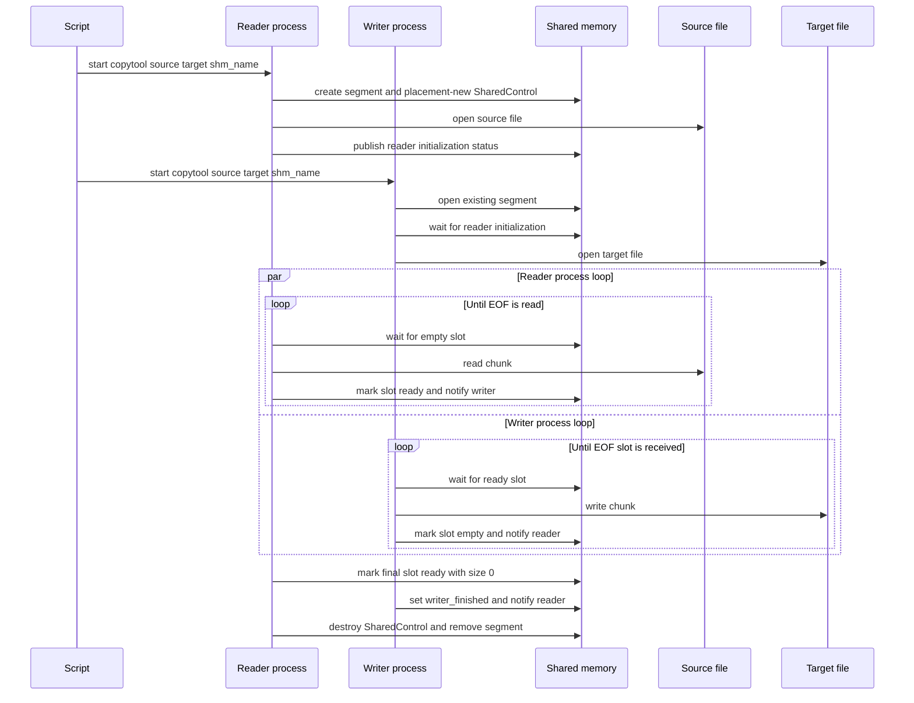

## copytool

A C++ file copy tool that uses two separate processes and shared memory.

The first started process acts as the reader and reads from the source file into a shared-memory ring buffer. The second started process acts as the writer and writes from shared memory into the destination file. Synchronization is done with Boost.Interprocess mutex and condition variables stored inside the shared memory segment.

### Build Requirements

- g++ with C++17 support
- make
- Boost.Interprocess headers
- gtest for running tests

### Building the Tool

```sh
make
```

This compiles `copytool.cpp` and `shared_segment.hpp` into the `copytool` executable.

### Running the Tool

The executable accepts three arguments:

```sh
copytool.exe <source_file> <target_file> <shared_memory_name>
```

Run it twice with the same shared memory name:

1. First process creates the shared memory segment and reads the source file.
2. Second process opens the shared memory segment and writes the target file.

On Windows, use the helper script:

```bat
copy_ipc.bat <source_file> <target_file> <shared_memory_name>
```

Example:

```bat
copy_ipc.bat input.txt output.txt copytool_shm
```

### Runtime Sequence



### Building the Tests

```sh
make test
```

Builds the tests. Requires gtest.

### Building and Running the Tests

```sh
make run_test
```

Builds and runs the tests. Requires gtest.